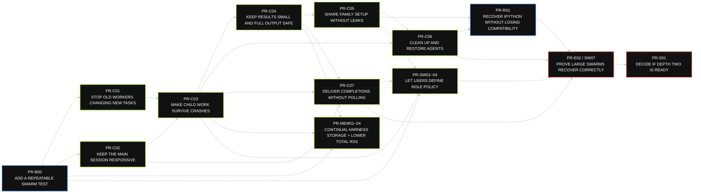
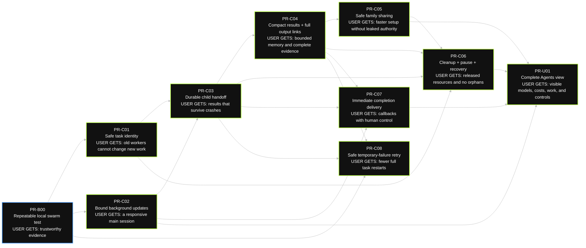
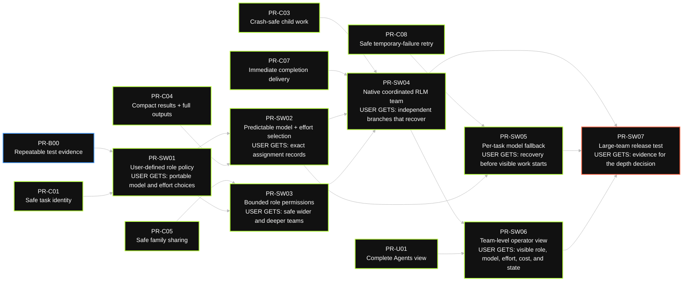
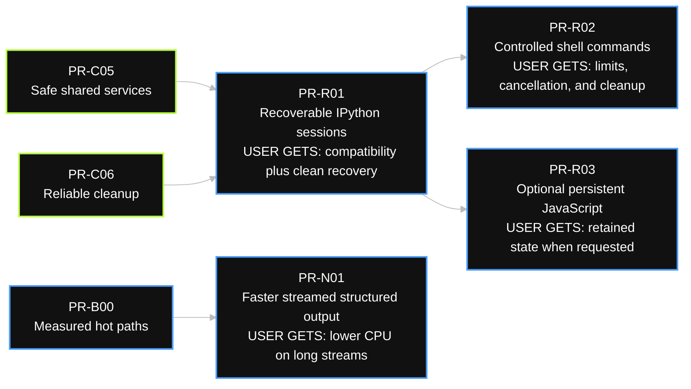
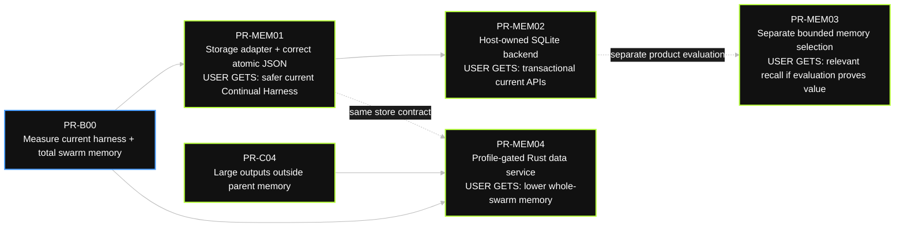
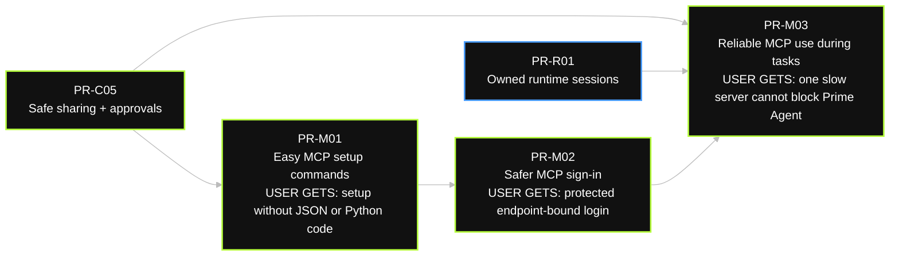
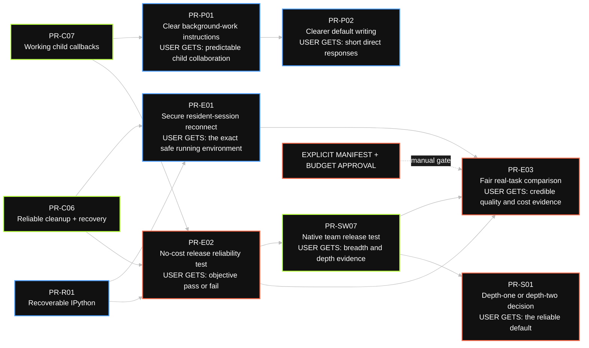

# High-Performance Prime Agent: Topological PR Plan

**Status:** Proposal for section-by-section review

**Primary view:** Potential pull requests, dependencies, features, goals, and release gates

**Detailed contracts:** [HIGH_PERFORMANCE_DESIGN_REFERENCE.md](./HIGH_PERFORMANCE_DESIGN_REFERENCE.md)

This is a graph-first plan.

Each node is a potential pull request.

An arrow means that the destination needs the source first.

No graph contains a dependency cycle.

Green nodes change the Prime Agent RLM path.

Blue nodes provide measurement or runtime infrastructure.

Orange nodes are manual release decisions.

Grey dashed nodes are optional experiments or profile-gated work.

The PR boundaries are proposals.

A reviewer can split a node again before implementation.

## 1. Non-negotiable boundaries

- Keep IPython as the compatible default Python executor.
- Keep `rlm()` admission nonblocking.
- Dispatch independent model requests independently.
- Do not add a global model semaphore, a client admission queue, a synthetic local `429`, or hidden executor batching.
- Keep the default recursion depth at `1` until the scale decision node passes.
- Keep family-scoped message and observation authority.
- Make arbitrary role labels, model, effort, allowed role edges, breadth, and depth configurable through a provider-neutral swarm profile.
- Do not hard-code any provider model family or model-profile alias into runtime routing.
- Persist exact requested and resolved role, model, revision, effort, fallback, and policy metadata.
- Attribute direct and downstream tokens and cost to every role, node, subtree, and routing decision.
- Treat decision ownership and reconciliation as coordination state. Do not turn them into a global request throttle.
- Require explicit approval for project MCP connections and process execution.
- Do not run a hosted or paid evaluation without an approved manifest and budget.
- Treat generated memory as derived data. Keep the session record authoritative.
- Use Rust only at a measured and reversible binary boundary.

## Plain-language PR guide

Read this section before the dependency graphs.

The graphs show order.

This section says what each PR adds to Prime Agent.

### PR-B00 in plain English

`PR-B00` adds a **local swarm rehearsal and report**.

It gives Prime Agent a pretend model provider that responds in a predictable way.

The test can start 1, 4, 16, or 64 agents and inject known delays, progress, failures, restarts, and completions.

It records timing, memory, messages, cleanup, and delivery results.

It removes secrets before it saves the report.

It also records the exact settings and versions that produced the report.

This PR does **not** make Prime Agent faster by itself.

It gives us a trustworthy way to prove whether every later PR makes Prime Agent faster and safer.

### Core agent runtime

| PR | What it adds | What a user or operator gets |
|---|---|---|
| `PR-B00` | A repeatable local swarm test and a shareable run report | Comparable evidence without model cost or leaked secrets |
| `PR-C01` | A clear identity and final state for every running task | A restarted or old worker cannot change a newer task |
| `PR-C02` | Protection against floods of progress, usage, timer, and status updates | The main session stays responsive while many children report work |
| `PR-C03` | Durable storage and handoff for accepted child work and completed results | Finished child work survives a parent or worker crash |
| `PR-C04` | Small result summaries with secure links to complete outputs | Large child output does not exhaust the parent, but the full evidence remains available |
| `PR-C05` | Safe sharing of approved context, tools, services, and permissions inside one agent family | Siblings reuse setup without inheriting secrets or broader authority |
| `PR-C06` | Reliable stop, cleanup, pause, recovery, and revival behavior | Finished work releases resources and stuck work does not leave orphan processes |
| `PR-C07` | Immediate child-completion delivery and human-input priority | The parent reacts without polling, and the user can still steer the session |
| `PR-C08` | A narrowly safe retry for a temporary model failure before visible work begins | A brief provider fault does not always restart the full task |
| `PR-U01` | A live Agents view with branch status, exact model, work, usage, cost, results, and controls | Operators can find and act on stalled or expensive work without reading raw logs |

### Native configurable swarms

| PR | What it adds | What a user or operator gets |
|---|---|---|
| `PR-SW01` | A catalog of arbitrary user-named roles, model choices, effort, allowed role edges, and safety limits | Users describe the kinds of agents available without fixing the task plan in advance |
| `PR-SW02` | Exact model, revision, effort, candidate, price, and routing estimate for each chosen role | Operators can see what was requested, what ran, why it changed, and its expected direct and downstream cost |
| `PR-SW03` | Rules for which configured roles may spawn other roles and which capabilities each role receives | Wider and deeper teams cannot silently gain permissions |
| `PR-SW04` | Native RLM coordination for a model-proposed task graph, accepted decisions, scope claims, and conflict reconciliation | The model stays free to choose tasks while dependent work follows one auditable decision and unrelated branches run independently |
| `PR-SW05` | A safe alternative model for one task when its selected model is unavailable | Unaffected branches keep moving without replaying visible actions |
| `PR-SW06` | Team role, depth, model, effort, direct and downstream cost, fallback, approval, and result data in the Agents view | Operators can understand the quality and total economics of the whole configured swarm |
| `PR-SW07` | A repeatable breadth, depth, replay, coordination, model-mix, quality, and total-cost campaign | The project gets evidence that the configured swarm is effective and economical, not merely busy |

### Execution runtimes and focused acceleration

| PR | What it adds | What a user or operator gets |
|---|---|---|
| `PR-R01` | Reliable ownership, interruption, cleanup, and recovery for the existing IPython session | Users keep packages, magics, rich output, host communication, and state after recoverable failures |
| `PR-R02` | A controlled direct path for shell commands | Selected command-line work gets clear limits, cancellation, output, and cleanup without using the notebook |
| `PR-R03` | An optional caller-selected persistent JavaScript session | JavaScript work can retain state without changing the Python default |
| `PR-N01` | Incremental handling of growing structured model output | Long streamed responses use less CPU because old content is not parsed again and again |

### MCP

| PR | What it adds | What a user or operator gets |
|---|---|---|
| `PR-M01` | Commands to add, inspect, trust, test, enable, disable, and remove MCP servers | Users configure MCP without hand-editing settings or writing a Python package |
| `PR-M02` | Browser sign-in, endpoint-bound credential storage, refresh, and logout | Users connect securely, and a changed URL cannot reuse the wrong login |
| `PR-M03` | One lazy bridge for HTTP and supervised stdio MCP servers | A slow or broken MCP server does not block Prime Agent or another server |

### Prompts, evaluation, and release

| PR | What it adds | What a user or operator gets |
|---|---|---|
| `PR-P01` | Default instructions for background children, completion messages, follow-up, and explicit steering | Models use the callback behavior more predictably after the runtime exists |
| `PR-P02` | A separate default rule for short, direct, plain-language prose | Default responses become easier to read while custom system prompts stay in control |
| `PR-E01` | Lifecycle and security hardening for the existing resident ACP stack | Users resume the correct running environment without a second ACP implementation or plaintext secret storage |
| `PR-E02` | A no-cost release test for fanout, overload, restart, cleanup, callbacks, permissions, artifacts, and depth two | Operators get an objective local pass or fail before defaults change |
| `PR-E03` | An approved capability-matched comparison with relevant alternative agent systems | Product claims use fair success, cost, recovery, and long-session evidence |
| `PR-S01` | One explicit decision about whether depth two becomes the default | Users get default depth two only after every reliability gate passes |

### Continual Harness storage and swarm memory

| PR | What it adds | What a user or operator gets |
|---|---|---|
| `PR-MEM01` | A private storage adapter under the existing Continual Harness API, plus atomic and conflict-safe JSON writes | Current prompt, memory, skill, subagent, and refinement behavior stays the same while storage becomes replaceable and safer |
| `PR-MEM02` | A host-owned SQLite backend behind that adapter, with reversible import from the current JSON files | Existing `rlm.harness` calls gain transactional persistence without a new memory API |
| `PR-MEM03` | A separate bounded memory-selection feature that can rank existing memory entries by scope and relevance | Agents can recall a small useful set without changing storage semantics or loading every entry |
| `PR-MEM04` | A profile-gated Rust data service behind the same adapter for transcripts, artifacts, indexes, and harness queries | The whole swarm uses less total memory only when measured total RSS proves the gain |

The technical tables below keep the exact dependencies, tests, release gates, and rollback boundaries.

## 2. Master PR topology

This graph shows the shortest view of the plan.

The core RLM path is on the top row.

Parallel runtime, MCP, prompt, and memory work does not block the core scale decision unless their capability is part of the deciding campaign.



**Expected system outcome:** Prime Agent can run a user-configured, model-proposed role swarm across a 64-child model-only fanout and a fixed depth-2 tree without losing results, blocking user input, retaining completed child state, or leaking owned resources.

**Release rule:** `PR-S01` changes the default from `1` to `2` only if `PR-E02` passes every recorded gate. Otherwise, it keeps the default at `1` and publishes the evidence.

## 3. Core RLM control-plane topology

This is the blocking path for safe high fanout.

Each node states the feature and the intended result.



### Core PR contracts

| PR | What it adds | User-facing goal | Technical merge gate | Safe rollback |
|---|---|---|---|---|
| `PR-B00` | Adds a local pretend model service, fixed 1/4/16/64-agent rehearsals, configurable token prices and downstream expansion, a run recorder, secret removal, and the exact test setup | Maintainers can repeat and compare scale, coordination, and model-economics tests without paid calls | The report computes every scale and economics rule from saved events. Secret fixtures do not appear in saved data | Turn off the test recorder. Production agent behavior does not change |
| `PR-C01` | Closed lifecycle and terminal enums, `operationId`, `childId`, `generation`, `assignmentId`, process-start identity, migration codecs | A stale worker, PID, callback, or cleanup task cannot act on a new actor | Invalid transition, old-session, partial-write, PID-reuse, and platform tests pass | Disable enforcement. Keep new fields and audits |
| `PR-C02` | Owner for every timer and background promise, hook error isolation, one coalesced drain, bounded activity and progress tails | Status and usage floods do not consume the root worker | At 64 children, event-loop delay p99 is below 100 ms. Managed task count returns to zero after close | Restore the old drain behind a flag. Keep raw diagnostic facts |
| `PR-C03` | Durable operation registry, append-only ledger, terminal outbox, parent inbox, consumed record, rebuildable active index | A child result survives every parent or worker crash boundary | Fault tests report zero lost and zero duplicate materializations | Dual-read the old delivery format. Stop new dispatch without deleting envelopes |
| `PR-C04` | Schema-versioned `ChildResult`, fixed caps, owner-scoped opaque artifacts, bounded previews, retention and audit | Parent memory grows with children and checkpoints, not child output volume | Invalid, missing, malformed, 1 MiB, 100 MiB, and 500 MiB replay tests pass | Keep legacy payload reads. Disable new externalization writes |
| `PR-C05` | Durable family ACL, `PreparedFamilyContext`, attenuated role manifests, owner and borrower leases, identity-bound approval | Siblings reuse safe discovery data without inheriting secrets, grants, or live parent objects | Cross-family access is zero. Workspace/config changes rebuild context. Stale approval fails closed | Disable each context or lease feature separately. Keep family identity checks |
| `PR-C06` | Meaningful-progress stalls, idempotent close, durable reaper, CAS passivation, detach-before-dispose, single-flight revival | Completed work releases heap and every owned resource reaches a typed state | Heap returns within 20% of pre-fanout. Leak count is zero within 30 s. Recovery is below 5 s p95 | Disable automatic passivation. Keep durable close and cleanup obligations |
| `PR-C07` | Inbox-first callback, `follow_up` default, explicit `steer`, safe-boundary human priority, event-driven input-pump wake | Completion reaches the parent without `sleep` polling and does not steal user control | At 64 children, human admission p95 is below 250 ms and p99 is below 1 s. Idle callback tests have zero loss | Disable callback scheduling. Preserve durable inbox items for replay |
| `PR-C08` | Retry one child request for typed transient provider failure only before replay-unsafe output | A transient provider fault does not restart the full task | Fake-provider tests show no retry after text, image, tool call, or side effect. No shared cap or local `429` exists | Disable automatic retry and retain the original diagnosis |
| `PR-U01` | Exact requested and resolved model, lifecycle, generation, current activity, usage, cost, context, result links, steer, revive, cancel, kill | An operator can find and act on expensive or stalled branches without reading full logs | Live and reloaded 64-child trees render correctly. Proposed update p95 is below 100 ms | Hide the new renderer while retaining metadata |

## 3.1 Native swarm topology

This lane makes user-defined role policy native to RLM.

Prime Agent does not define a required planner, researcher, implementation, or reviewer vocabulary.

Role names are arbitrary labels in user or trusted project configuration.

The configuration is specific about models, effort, permissions, allowed role edges, output contracts, and hard graph limits.

It does not prescribe the tasks or task graph.

The planning model chooses the decomposition, roles, number of agents, dependencies, breadth, and depth for each task within those limits.

A user may also supply a task graph directly.

It does not add a second scheduler.

It compiles the selected role policy before the first child admission.

Every dependency-ready child still uses ordinary nonblocking `rlm()` admission.

Every admitted independent model request still dispatches independently.

### Relevant swarm economics evidence

The [Cursor swarm economics study](https://cursor.com/blog/agent-swarm-model-economics) supports three design hypotheses.

First, role separation can save context because one agent can keep global intent while another focuses on bounded execution detail.

Second, the best model mix depends on total downstream work, not only the planner's token price.

The study reports that workers used at least 69% of tokens and more than 90% in most runs.

It reports similar final quality across several mixes with a large cost range.

Third, high activity can be coordination thrash rather than progress.

Its older harness produced far more changes and conflicts while performing worse.

This is one publisher-authored study on one long implementation task.

It is not independent proof of a universal routing rule.

Prime Agent must test each user-selected model mix and prompt version.

It must not hard-code a frontier-planner and cheap-worker taxonomy.

The design absorbs the portable lessons:

- context-specialized roles are configurable, not mandatory;
- one accepted decision version can own an exclusive design scope;
- dependent work references that accepted decision;
- conflicting decisions create a reconciliation task instead of silent overwrite;
- shared successor context is bounded, versioned, attributable, and stored through existing Continual Harness or artifact interfaces;
- review is an ordinary model-proposed task, not a privileged always-on agent;
- task quality, cost, conflict, rework, and downstream tokens matter more than raw change count.

Coordination rules apply only to conflicting scopes and declared dependencies.

They must not serialize unrelated model requests.



### Swarm profile example

Do not name reusable configuration profiles after one provider's model variants.

Separate **role labels** from **model-profile aliases**.

A role says what authority an agent has.

A model profile says what model capability and effort the role should request.

Both sets of labels are user-defined.

This example calls the model profiles `deliberate`, `general`, and `fast`.

Those names can point to any provider models that meet the declared requirements.

The exact model IDs below are only one user's bindings.

```yaml
apiVersion: prime-agent.swarm/v1
name: mixed-effort-team
entryRole: lead
limits:
  # These are structural tree bounds. They are not request-concurrency limits.
  maxChildDepth: 1
  maxNodes: 16
  maxEdges: 32
  maxChildrenPerNode: 3
  plannedTokens: 900000
  plannedCostUsd: 12.00
modelProfiles:
  deliberate:
    requiredCapabilities: [tools, structured_output, high_reasoning]
    candidates:
      - provider: prime-inference
        model: openai/gpt-5.6-sol
        revision: provider-or-user-pin
        effort: high
    fallbackProfiles: [general]
    onUnsupportedEffort: error
  general:
    requiredCapabilities: [tools, structured_output]
    candidates:
      - provider: prime-inference
        model: openai/gpt-5.6-terra
        revision: provider-or-user-pin
        effort: medium
    fallbackProfiles: [fast]
    onUnsupportedEffort: error
  fast:
    requiredCapabilities: [tools, structured_output]
    candidates:
      - provider: prime-inference
        model: openai/gpt-5.6-luna
        revision: provider-or-user-pin
        effort: low
    onUnsupportedEffort: error
capabilityProfiles:
  read-only:
    tools: [repository_read, web_search, agent_message, agent_observe]
    filesystem: { roots: ["/workspace"], write: false }
    process: deny
    mcp: { servers: [], connect: deny }
  edit-approved:
    tools: [repository_read, repository_write, agent_message, agent_observe]
    filesystem: { roots: ["/workspace"], write: true }
    process: { requireApproval: true, argvPolicy: approved }
    mcp: { servers: [github], connect: requireApproval }
roles:
  lead:
    modelProfile: deliberate
    allowedModelProfiles: [deliberate, general]
    allowedChildRoles: [deep-worker, general-worker, fast-worker]
    maxChildren: 3
    output: { schema: PlanGraphV1, terminalPolicy: required }
    capabilities: read-only
  deep-worker:
    modelProfile: deliberate
    allowedChildRoles: []
    maxChildren: 0
    output: { schema: TaskResultV1, terminalPolicy: required }
    capabilities: read-only
  general-worker:
    modelProfile: general
    allowedChildRoles: []
    maxChildren: 0
    output: { schema: TaskResultV1, terminalPolicy: required }
    capabilities: edit-approved
  fast-worker:
    modelProfile: fast
    allowedChildRoles: []
    maxChildren: 0
    output: { schema: TaskResultV1, terminalPolicy: required }
    capabilities: read-only
```

The planning model can choose any permitted role for each task.

Another user can bind `deliberate`, `general`, and `fast` to different OpenAI models, another provider, or a mixed-provider candidate list.

Prime Agent must not infer behavior from an alias such as `deliberate`.

It must use only the explicit capability and policy fields.

### Swarm configuration and precedence

Proposed commands are:

```text
prime-agent swarm init <name>
prime-agent swarm list
prime-agent swarm get <name>
prime-agent swarm validate <file-or-name>
prime-agent swarm doctor <file-or-name>
prime-agent swarm remove <name>
prime-agent --swarm <name>
```

User profiles may live under the Prime Agent config directory.

A project may declare a profile in `.prime-agent/swarm.yaml`.

Prime Agent must require project trust before it uses that file.

Compile the effective profile to canonical JSON once at root acceptance.

Store its redacted form, fingerprint, schema version, policy versions, and source scopes.

Apply policy in this order:

1. Hard platform and release policy.
2. The parent actor's current grants and generation-bound approvals.
3. The root session or approved evaluation manifest.
4. The selected swarm role and graph node.
5. Versioned schema defaults.

A lower item cannot widen a higher item.

Reject unknown fields, missing selectors, fallback cycles, graph cycles, unknown roles, missing output schemas, invalid effort values, and structural-limit violations.

A project profile cannot interpolate environment secrets.

Credentials remain endpoint-bound secret references outside the profile.

### Swarm runtime contract

`PlanGraphV1` is a bounded declarative task graph proposed at run time by the planning model or supplied by the user.

The role policy does not predeclare its nodes or edges.

Each node has a stable `nodeId`, role, dependency IDs, task packet or artifact references, output schema, and an optional model selector from that role's allow-list.

Persist and validate the plan before worker admission.

A model-generated plan is not executable authority until validation succeeds.

A node becomes eligible only after durable terminal results exist for all dependencies.

Admit every eligible independent node through ordinary `rlm()` immediately.

Do not create a swarm-wide concurrency semaphore, token bucket, queue, hidden batch, or local `429`.

`maxNodes`, `maxChildrenPerNode`, and `maxChildDepth` limit graph shape.

They do not delay an admitted request.

Budget fields provide estimates, visibility, warnings, and explicit stop or cancel controls for future unstarted expansion.

They do not hold an already admitted independent request.

Capability resolution is an intersection:

```text
platform ∩ parent grant ∩ role policy ∩ node request ∩ active approval
```

A child cannot gain a model, tool, filesystem root, process right, MCP server, spawn role, secret, or artifact right that its parent cannot grant.

Persist requested role, requested model, requested effort, resolved provider, resolved model, resolved revision, resolved effort, fallback cause, adapter version, effective request parameters, usage, cost, and policy fingerprint.

Replay an accepted assignment from that record.

Do not re-resolve it after a crash unless a new generation records an explicit reassignment.

### Coordination and economics contract

A role or task node may declare an exclusive decision scope and a bounded implementation scope.

The runtime must persist scope claims and accepted decision versions.

A dependent node should receive an immutable decision reference instead of the complete decision-maker transcript.

Conflicting decision proposals must create a typed conflict.

A model-proposed reconciliation node or operator resolves that conflict by creating a new decision version.

Do not rewrite the earlier decision record.

Do not make a conflict in one scope block unrelated ready nodes.

A bounded shared guide may use the existing session-local Continual Harness or an owner-scoped artifact.

It must have byte, line, token, entry, and writer limits.

Every revision must record its author, evidence, version, and task graph generation.

Do not inject arbitrary shared text as privileged system instruction.

Review work is a normal task node with the same family authority and cost accounting as any other node.

A user may configure multiple review views, but Prime Agent must not create an always-on reviewer by default.

For each model assignment, record:

- the candidate model profiles and selection rationale;
- requested and resolved provider, model, revision, and effort;
- estimated input, output, cached, and reasoning tokens when available;
- price-card version, currency, effective time, and estimate uncertainty;
- actual direct tokens and provider cost;
- fallback and retry cost;
- downstream tokens and cost for the decision subtree;
- storage, review, and other measured non-inference cost separately.

Unknown billing fields must remain `unknown`.

Do not fabricate precision.

A cheaper direct planning request is not an economy when it causes substantially more worker work.

The Agents view and run report must show direct cost, downstream cost, and estimate variance separately.

### Swarm PR contracts

| PR | What it adds | User-facing goal | Technical merge gate | Safe rollback |
|---|---|---|---|---|
| `PR-SW01` | Schema, canonicalization, fingerprint, project trust, arbitrary role labels, optional decision and implementation scopes, bounded shared context, and validation | Users define a provider-neutral role catalog and coordination envelope without fixing the task graph | Canonical fingerprints are stable. Invalid selectors, scopes, guide limits, and graphs fail closed | Keep the parser read-only or disable profile selection |
| `PR-SW02` | Exact provider, model, revision, effort, candidate set, capability, price card, estimate, selection rationale, fallback, and adapter metadata | Every assignment is reproducible and its expected direct and downstream economics are visible | Fake adapters cover supported, unsupported, unavailable, priced, unpriced, and fallback cases. No model-name heuristic exists | Use the current explicit model selector and retain recorded metadata |
| `PR-SW03` | Role graph, allowed child roles, structural limits, decision-scope rules, bounded shared context, prepared context, output policy, and monotonic capability attenuation | Breadth, depth, and coordination follow user policy without granting new authority or duplicating exclusive decisions | Generated role-tree property tests never widen a grant. Exclusive-scope conflicts become typed reconciliation work. Cross-family and stale-approval tests fail closed | Disable role enforcement. Keep the manifest visible |
| `PR-SW04` | Validate and persist a model-proposed `PlanGraphV1`, scope claims, decision versions, references, conflicts, reconciliation, and shared-context revisions before ordinary nonblocking RLM admission | The model chooses a task-specific team while downstream work follows one auditable decision lineage | Ready unrelated siblings start independently. Conflict and crash replay produce zero lost, duplicate, or silently overwritten decisions or node materializations | Disable DAG dispatch. Existing direct `rlm()` calls keep working |
| `PR-SW05` | Per-assignment model fallback using replay-safe retry rules, with original and revised cost estimates and typed cause | One unavailable model can fall back without replaying a visible or side-effecting action or hiding its economics | Fallback compatibility, estimate, attribution, and partial-output tests pass. There is no shared request controller | Disable fallback and return the typed original failure |
| `PR-SW06` | Role, depth, requested/resolved model and effort, direct and downstream token and cost estimates, actual cost, price-card version, fallback, approval, state, and result in the Agents tree | Operators can understand the quality and total economics of the whole swarm | Live, priced, unpriced, estimate-variance, downstream-attribution, fallback, reload, terminal, and redaction tests pass at 64 nodes | Hide swarm columns and retain durable metadata |
| `PR-SW07` | Deterministic breadth, depth, fault, decision conflict, shared context, ACL, replay, fallback, total-cost attribution, model-mix, and independent-dispatch campaign | Give the depth and routing policy evidence based on task quality, cost, context efficiency, rework, and recovery | Every core and swarm gate passes. Any real-model matrix has an approved manifest and budget | Publish the report and keep the default at `1` |

### Swarm-specific gates

| Gate | Proposed pass rule |
|---|---|
| Manifest determinism | The same effective config produces the same canonical manifest fingerprint |
| Assignment replay | Restart uses the recorded assignment. It does not silently resolve a different model or effort |
| Model visibility | Requested and resolved provider, model, revision, effort, role, and fallback cause are exact for root and every child |
| Capability attenuation | Property and fault tests report zero child authority wider than the parent grant |
| Structural enforcement | Invalid depth, breadth, node, edge, role, and graph-cycle requests fail before admission with a typed result |
| Independent dispatch | Every dependency-ready admitted sibling starts without waiting for another sibling or a Prime Agent model queue |
| Durable graph replay | Faults at plan, assignment, outbox, inbox, consume, and fallback boundaries produce zero lost and zero duplicate node materializations |
| Decision integrity | An exclusive decision scope has one accepted version. Dependent nodes reference it. Conflicts produce a durable reconciliation record instead of silent overwrite |
| Shared context | Every shared-guide revision is bounded, attributable, versioned, and replayable. It never becomes unreviewed privileged instruction |
| Cost visibility | Direct and downstream estimates and actual usage are attributed to node, role, subtree, and routing decision with a pinned price card. Unknown billing data remains unknown. A warning never becomes a hidden request throttle |
| Economic evaluation | The campaign reports verified task quality, wall time, direct cost, downstream cost, token mix, context use, conflict, rework, and review yield. Raw event or change count is not a productivity score |
| Depth 2 | A fixed model-proposed depth-2 role tree passes every core and swarm gate |

Until `PR-SW07` and `PR-S01` pass, `maxChildDepth` is release-capped at `1` by default.

A larger explicit expert value must remain subject to the host's hard safety ceiling and current release policy.

## 4. Runtime topology

IPython remains the default.

Bun and direct process execution are explicit choices.

Prime Agent adds no new worktree manager, per-child worktree policy, patch protocol, or worktree cleanup path.

Coding agents keep their existing model-directed Git worktree behavior.



### Runtime PR contracts

| PR | What it adds | User-facing goal | Technical merge gate | Safe rollback |
|---|---|---|---|---|
| `PR-R01` | Lazy IPython lease, same-kernel serialization, cooperative interrupt, grace, owned kill, poison, quarantine, fresh generation | Keep packages, magics, rich output, host communication, and state while making failure recoverable | Compatibility suite passes. Ignored-interrupt fixture leaves no orphan and the next cell works | Disable the new lease manager. Keep the current production IPython path |
| `PR-R02` | Explicit argv, environment, cwd, timeout, output cap, cancellation, process group, exit and truncation metadata | Shell work gets a narrow safe path without routing through IPython | Timeout, output, signal, child-process, and secret-redaction tests pass | Disable the runner tool |
| `PR-R03` | Explicit lazy persistent Bun session with the same artifact and host-bridge contract | JavaScript tasks keep state and avoid repeated startup when the caller selects Bun | Persistence, cancel, reset, artifact, bridge, and selection tests pass. Automatic language guessing is absent | Disable the Bun selector |
| `PR-N01` | Append streamed bytes once, parse growing structured output incrementally, then run one strict final validation | Long streamed responses stop reparsing their full prefix | Differential Unicode, malformed, nesting, and truncation tests pass. The named CPU profile improves | Select the current parser |

## 4.1 Continual Harness storage and whole-swarm memory

Prime Agent already has a memory abstraction.

Memory is one `HarnessEntry` kind beside prompt notes, skills, and subagent specifications.

The public surface is `rlm.harness` and `HarnessState`.

This plan keeps that surface.

It does not add a separate memory product or ask agents to use a second API.

The first change is an internal storage adapter under the existing abstraction.

Current prompt rendering, local and global scopes, CRUD calls, sorting, refinement, rollback, and JSON export must remain compatible.



### Is SQLite the right choice?

SQLite is the leading next backend for the current local-first harness.

It provides transactions, crash recovery, indexed ordered reads, and one local file without a server.

It can also replace the current weak coordination between Python and TypeScript JSON writers.

It is not an architectural requirement.

`PR-MEM01` keeps JSON and first creates the backend contract.

`PR-MEM02` must benchmark SQLite before it becomes the default.

JSON may remain faster and simpler for a very small single-writer store.

A remote database is not the default because it would weaken offline use, privacy, and local session recovery.

### Existing abstraction boundary

Keep these agent-visible behaviors unchanged:

- `rlm.harness.create_memory`, `update_memory`, and `delete_memory`;
- generic prompt, memory, skill, and subagent entry CRUD;
- local and global scope routing;
- current ID, version, error, sort, overview, and snapshot behavior;
- current prompt caps and formatting;
- refinement before/after state and rollback;
- JSON v1 import and export.

Add a private store contract such as:

```ts
interface HarnessStore {
  load(scope: HarnessScope, location: HarnessLocation): Promise<HarnessState>;
  commit(state: HarnessState, expectedGeneration: number): Promise<CommitResult>;
  apply(edits: HarnessEdit[], expectedGeneration: number): Promise<ApplyResult>;
  exportJsonV1(): Promise<HarnessSnapshotV1>;
}
```

The TypeScript host should own the authoritative production store.

Kernel `rlm.harness` calls should use the existing host bridge.

Do not implement separate Python and TypeScript SQLite writers.

### Memory PR contracts

| PR | What it adds | User-facing goal | Technical merge gate | Safe rollback |
|---|---|---|---|---|
| `PR-MEM01` | A private `HarnessStore` adapter, one canonical JSON v1 normalizer, atomic JSON replacement, store generation, conflict checks, and Python/TypeScript conformance fixtures | The current Continual Harness becomes crash-safe and replaceable without changing agent calls or prompt behavior | Public signatures, local/global routing, sorting, errors, merge behavior, prompt output, snapshots, refinement rollback, and JSON fixtures remain compatible. Concurrent writers cannot silently lose an edit | Select the corrected JSON adapter |
| `PR-MEM02` | A host-owned SQLite store behind `HarnessStore`, one database per existing harness directory, transactional CRUD/refinement, kernel bridge calls, reversible JSON import, immutable backup, and JSON export | Existing `rlm.harness` operations gain one transactional authority | Warm/cold prompt build, 1k/10k/100k entries, concurrent host/kernel writes, crash recovery, migration, export equality, permissions, and rollback tests pass | Select the JSON adapter and restore the preserved export |
| `PR-MEM03` | A separately reviewed memory-selection API with scope, relevance, token, item, byte, and time limits | Agents can recall a small relevant set when the feature proves better than the current deterministic capped listing | Quality and latency evaluation passes. Current prompt formatting stays the default until an explicit product decision | Disable selection and use current sorted capped injection |
| `PR-MEM04` | A Rust data service behind stable store and artifact interfaces for measured transcript, artifact, index, or harness-query ownership; Node keeps only IDs and small previews | The complete swarm uses less memory without changing Continual Harness semantics | Summed steady-state RSS is at most 80% of baseline, peak at most 90%, and per-agent RSS slope at most 50%. Compatibility and long-session gates pass | Use the TypeScript host plus JSON or SQLite backend |

### Rust memory rule

The small current harness ledger may not be a major memory cost.

Ordinary prompt injection currently reads a small capped set.

Do not claim that moving this ledger to Rust will solve agent memory.

The larger opportunity is to stop each Node actor from retaining complete transcripts, tool payloads, artifact metadata, and large indexes.

A Rust service is useful only when Node releases those graphs and the service returns bounded handles or streams.

Measure summed RSS and PSS across Node, Rust, databases, workers, and Python kernels.

Node heap alone is not the acceptance metric.

## 5. MCP topology

MCP is an independent product lane.

It does not gate model dispatch or the depth-2 decision.



### MCP PR contracts

| PR | What it adds | User-facing goal | Technical merge gate | Safe rollback |
|---|---|---|---|---|
| `PR-M01` | Declarative CLI, user/project scopes, preview, trust, enable/disable, migration backup, redacted JSON | A user adds a server without editing settings JSON or writing a Python package | `list` contacts no server. An untrusted project cannot connect or execute. Migration round trip passes | Disable project writes and retain the existing settings path |
| `PR-M02` | OAuth PKCE and resource discovery, keychain references, endpoint-bound credential identity, logout | A URL change cannot inherit a token by server name | Secret, endpoint-change, callback, refresh, logout, and redaction tests pass | Disable login while retaining nonsecret config |
| `PR-M03` | Generic `mcp.server(name)` bridge, HTTP, supervised stdio, lazy connection, per-server lifecycle epoch, owner/borrower lease | A slow or failed server does not block ready state or affect another server | Slow, failed, disconnect, old-epoch, restart, auth, cancellation, and process-group cleanup tests pass | Disable the generic bridge and retain config metadata |

## 6. Product, evaluation, and release topology

Prompt changes do not substitute for runtime behavior.

Deterministic control-plane evaluation comes before hosted model evaluation.



### Product and evaluation PR contracts

| PR | What it adds | User-facing goal | Technical merge gate | Safe rollback |
|---|---|---|---|---|
| `PR-P01` | Rebase PR #1034 after runtime callback behavior exists. Keep it prompt-only | The model understands nonblocking work, callbacks, `follow_up`, and explicit `steer` | Exact prompt tests and runtime behavior tests pass. The PR makes no untested callback claim | Revert the prompt block |
| `PR-P02` | Separate ASD-STE100-oriented default-prompt rule | Generated prose uses short direct sentences and common words without changing code or required terms | Default prompt snapshots pass. Fully custom system prompts remain replacement behavior and opt out | Revert the prompt block |
| `PR-E01` | Extend and harden the existing ACP stack and PR #805. Add secret references, permissions, exact session and kernel identity, environment propagation, reconnect, and fault tests. This is not a parallel ACP implementation | Existing ACP reconnects to the exact safe runtime and does not persist plaintext secrets | Deterministic reconnect and fault tests pass. The supplied secret is absent from descriptors, logs, snapshots, telemetry, and errors | Keep resident ACP disabled and continue nonresident mode |
| `PR-E02` | Fixed fake-provider campaigns for fanout, update flood, restart, passivation, callback, ACL, artifact, reaper, and depth 2 | Produce objective control-plane evidence without model variance or paid calls | Five warmups and ten measured campaigns per fanout pass the scale gate table below | Merge the harness and keep production flags off |
| `PR-E03` | Pinned capability-aware comparison with relevant alternative agent systems plus approved Verifiers tasks | Measure task success, cost, startup, RSS, delivery, recovery, and long-session behavior fairly | Exact model, tasks, environment, limits, seeds, trajectories, manifest, and approved budget are recorded | Do not run or publish a release claim |
| `PR-S01` | One explicit recursion-policy change after the deciding report | Raise default recursion to `2` only when depth 2 passes every control-plane gate | All `PR-E02` gates pass. A failed gate keeps default `1` and depth above `1` expert-only | Revert the default value to `1` |

## 7. Core scale gates

These are proposed targets.

Approve or change them before implementation.

| Gate | Proposed pass rule |
|---|---|
| Independent dispatch | Every fake-provider request starts without a Prime Agent global admission queue or synthetic rate response |
| Fanout responsiveness | At 64 active model-only children, human prompt admission p95 is below 250 ms and p99 is below 1 s |
| Event-loop health | Root worker event-loop delay p99 is below 100 ms during the fixed 64-child event load |
| Attach and heartbeat | Attach and heartbeat responses have p99 below 1 s during the same load |
| Durable delivery | Inbox, consumed, and terminal audit reconciliation reports zero lost and zero duplicate materializations |
| Parent record growth | Child usage and status records grow with children plus configured checkpoints, not child message count |
| Heap recovery | After completion and passivation, forced-GC heap is within 20% of its pre-fanout value |
| Whole-swarm memory | With the Rust data path enabled, steady-state summed RSS is at most 80% of baseline, peak is at most 90% of baseline, and per-agent RSS slope is at most 50% of baseline |
| Continual Harness compatibility | JSON and SQLite backends preserve current `rlm.harness`, local/global scope, prompt rendering, refinement, migration, export, and rollback behavior |
| Memory selection | Any new relevance retrieval passes a separate quality and latency evaluation before it changes current deterministic capped injection |
| Long session | The control-plane lane passes the fixed 2-hour, 200k-context run. The memory lane also passes 10,000 turns or 24 hours without OOM or an unbounded final-half total-RSS slope |
| Teardown | Worker, kernel, stdio MCP, socket, lease, and descriptor leak count is zero within 30 seconds after close |
| Recovery | Supervisor, worker, and kernel fault fixtures reach a correct typed state within 5 seconds p95 |
| Swarm manifest | Canonical fingerprint, requested and resolved role/model/effort, and policy version are exact after replay |
| Swarm authority | No child role, tool, filesystem, process, MCP, spawn, secret, or artifact grant exceeds the parent grant |
| Swarm dispatch | Every dependency-ready admitted sibling starts independently. Structural node limits do not become a concurrency queue |
| Depth 2 | The fixed model-proposed depth-2 role tree passes all core and swarm rules above |

Use a deterministic fake provider for these control-plane gates.

Run five warmups and ten measured campaigns at each fanout level.

Keep raw events, process samples, fault schedules, and the deciding manifest.

## 8. Suggested section-by-section review path

Review one graph at a time.

For each node, decide `keep`, `split`, `merge`, `change`, or `remove`.

1. **Core boundaries:** Confirm section 1.
2. **Core control plane:** Review `PR-B00` through `PR-C08` and `PR-U01`.
3. **Native swarm:** Review `PR-SW01` through `PR-SW07`, including the separation of role labels from model-profile aliases.
4. **Runtime:** Review `PR-R01`, `PR-R02`, `PR-R03`, and `PR-N01`.
5. **MCP:** Review `PR-M01` through `PR-M03`.
6. **Prompts and ACP:** Review `PR-P01`, `PR-P02`, and the existing ACP-stack extension `PR-E01`.
7. **Continual Harness and Rust:** Review `PR-MEM01` through `PR-MEM04`. Preserve the current abstraction. Use whole-swarm memory as the Rust deciding metric.
8. **Scale decision:** Approve or change the targets in section 7.
9. **Hosted evaluation:** Approve a manifest and budget only after deterministic gates pass.
10. **Recursion:** Decide whether `PR-S01` keeps default `1` or changes it to `2` from the recorded evidence.

## 9. Detailed contract index

Use the [detailed reference](./HIGH_PERFORMANCE_DESIGN_REFERENCE.md) when a graph node needs implementation detail.

| Graph area | Detailed reference |
|---|---|
| Evidence and current blockers | [Sections 3–4](./HIGH_PERFORMANCE_DESIGN_REFERENCE.md#3-architecture-baseline-and-evidence) |
| Lifecycle, ledger, callbacks, storage, approvals | [Section 5](./HIGH_PERFORMANCE_DESIGN_REFERENCE.md#5-target-actor-and-lifecycle-design) |
| Fanout, memory, results, UI, isolation, retry | [Section 6](./HIGH_PERFORMANCE_DESIGN_REFERENCE.md#6-massive-subagent-design) |
| Native swarm roles and profiles | [Section 6.7](./HIGH_PERFORMANCE_DESIGN_REFERENCE.md#67-native-swarm-roles-and-profiles) |
| Recursion policy | [Section 7](./HIGH_PERFORMANCE_DESIGN_REFERENCE.md#7-recursion-policy) |
| IPython, Bun, and process runner | [Section 8](./HIGH_PERFORMANCE_DESIGN_REFERENCE.md#8-executor-and-repl-plan) |
| Continual Harness storage and whole-swarm memory | [Section 9](./HIGH_PERFORMANCE_DESIGN_REFERENCE.md#9-continual-harness-storage-and-rust-data-service) |
| Prompt changes | [Section 11](./HIGH_PERFORMANCE_DESIGN_REFERENCE.md#11-prompt-callbacks-and-pr-1034) |
| ACP and evaluation | [Section 12](./HIGH_PERFORMANCE_DESIGN_REFERENCE.md#12-acp-and-evaluation-plan) |
| MCP | [Section 13](./HIGH_PERFORMANCE_DESIGN_REFERENCE.md#13-first-class-mcp-flow) |
| Fair comparison and traceability | [Section 14](./HIGH_PERFORMANCE_DESIGN_REFERENCE.md#14-capability-matched-evaluation-protocol) |
| Telemetry and gates | [Section 16](./HIGH_PERFORMANCE_DESIGN_REFERENCE.md#16-telemetry-benchmarks-and-decision-log) |

## 10. First review decision

Start with the core RLM control-plane graph in section 3.

The first question is whether `PR-C03` should contain both the operation registry and terminal delivery, or whether it should split into two PRs.

The recommended split is:

1. `PR-C03A`: durable operation registry, input identity, and active index.
2. `PR-C03B`: terminal outbox, parent inbox, acknowledgement, consumed record, and reconciliation.

`PR-C03B` depends on `PR-C03A`.

This split reduces correctness risk and gives each crash matrix one linearization point.
## 11. Implementation orchestration and stacked PR delivery

The architecture graph is not the implementation process.

Use one main orchestrator for the complete program.

The main orchestrator owns the dependency graph, active stack goals, evidence index, merge order, and final integration decision.

It should coordinate work rather than become another implementation worker.

### Goal hierarchy

Prime Agent supports one active persistent goal per top-level session.

Use goals at durable ownership boundaries:

1. The main orchestrator has one umbrella `/goal` for the approved implementation program.
2. Each active PR stack has one top-level stack-owner session with its own `/goal`.
3. A large independent PR may have a dedicated top-level owner and `/goal`.
4. Short-lived RLM subagents do not create nested persistent goals. They receive bounded tasks and explicit handoff contracts.

Proposed main command:

```text
/goal Deliver the approved high-performance Prime Agent program in dependency order. Keep each PR narrow, preserve compatibility and rollback, run every required gate, resolve reviews and CI, and complete only after the approved stack is merged and verified on the default branch.
```

Proposed stack command:

```text
/goal Deliver stack <stack-name>: <ordered PR IDs>. Preserve each PR boundary and declared base. Complete only after every PR passes its local and integration gates, all required reviews and CI are resolved, the stack lands in dependency order, and final evidence and rollback references are recorded.
```

A PR owner task must state:

```text
PR ID and product outcome
branch, direct base, and starting SHA
owned files and APIs
explicit exclusions
required tests and CI
required evidence
rollback or feature-flag boundary
completion condition
```

Do not start these goals until implementation begins and the user approves the first tranche.

### Worker model

Each stack owner uses nonblocking RLM subagents for independent work:

- implementation agents own bounded files and behavior;
- test agents create or run targeted and integration checks;
- security reviewers inspect trust, secrets, processes, ACLs, and migration;
- performance reviewers inspect raw samples, total RSS, latency, and event-loop behavior;
- compatibility reviewers inspect existing APIs, session data, prompts, and platform behavior;
- review monitors track CI, human comments, and review-bot findings until the PR is ready to land.

The stack owner dispatches independent tasks independently.

It does not add a shared model-request queue or concurrency cap.

Each subagent returns a structured handoff with task ID, PR, base SHA, head SHA, changed paths, commands, results, findings, artifact links, risks, and rollback.

Store durable handoffs and the stack ledger through the existing Continual Harness abstraction.

Do not depend on a specific future Harness backend.

### Proposed implementation stacks

Only hard dependencies should create a stack.

Keep a stack short enough to rebase and review easily.

| Stack | Ordered PRs | Starts when | Product outcome |
|---|---|---|---|
| Measurement | `B00` | First | Reproducible local scale, fault, cost, and memory evidence |
| Core identity and delivery | `C01 → C02 → C03A → C03B` | `B00` stable | Safe identities, bounded updates, durable accepted work, and crash-safe terminal delivery |
| Bounded state and recovery | `C04 → C05 → C06` | Core delivery interfaces stable | Compact results, family safety, cleanup, passivation, and revival |
| Interaction and operator control | `C07 → C08 → U01` | Durable delivery and recovery stable | Immediate callbacks, safe retry, and a complete Agents view |
| Swarm policy | `SW01 → SW02 → SW03` | Family authority and model metadata stable | Arbitrary roles, exact model economics, and attenuated authority |
| Swarm runtime | `SW04 → SW05 → SW06` | Swarm policy and callbacks stable | Model-proposed task graphs, decision lineage, fallback, and operator economics |
| Execution runtimes | `R01` then parallel `R02` and `R03`; `N01` independent | Cleanup and artifact contracts stable | Recoverable IPython, explicit shell and JavaScript paths, and faster streamed structure |
| Continual Harness storage | `MEM01 → MEM02` | Measurement fixtures ready | Compatible storage adapter, correct JSON, and reversible host-owned SQLite |
| Memory selection | `MEM03` | `MEM02` measured and product evaluation approved | Separately evaluated bounded relevance selection |
| Rust data ownership | `MEM04` | `B00`, `C04`, and stable store interfaces; profile gate passes | Lower whole-swarm RSS with reversible bounded native ownership |
| MCP | `M01 → M02 → M03` | Family trust and runtime ownership stable | First-class setup, secure login, and isolated lazy transports |
| Existing ACP stack | `E01` on the existing ACP branch graph | Core lifecycle interfaces stable | Hardened resident reconnect without a parallel ACP implementation |
| Prompt policy | `P01` after `C07`; `P02` separate and rebased after prompt conflicts settle | Runtime behavior exists | Accurate callback guidance and clearer default prose |
| Release evidence | `E02 → SW07 → S01`; `E03` requires separate budget approval | All deciding implementation stacks stable | Deterministic scale decision, model-economics evidence, and explicit recursion default |

Do not keep one long 20-PR branch chain.

Merge a foundation stack before opening a deeply dependent stack when practical.

Independent stacks target the current default branch.

### Branch and PR protocol

Before implementation, refresh the default branch and record the exact starting SHA.

Create each dependent branch from its direct parent branch.

A PR description must state:

- stack name and position;
- direct parent PR and base SHA;
- product behavior added;
- code and behavior excluded;
- tests and evidence;
- dependency it unlocks;
- rollback boundary.

While a stack is open, each child PR targets its direct parent branch.

After the parent merges, rebase the next child onto the new default branch, rerun affected checks, and update its PR base.

Fix a defect in the lowest PR that owns the contract.

Then rebase descendants in topological order.

Do not copy the same fix into several branches.

Use existing coding-agent Git and worktree behavior.

This plan adds no new worktree manager.

### Review, CI, and monitoring

Every PR needs:

- the repository's required format, lint, type, build, unit, and integration checks for its scope;
- targeted product-behavior tests;
- no unresolved blocking human or review-bot finding;
- an independent diff review against the PR goal;
- a complete evidence and rollback handoff.

Every stack tip needs an install, build, test, and integration run for the complete stack behavior.

A review monitor should check CI and new comments at the normal approximately 90-second cadence until landing readiness.

Classify every finding as fixed, invalid with evidence, or explicitly deferred with an owner.

After any fix, rerun the affected evidence against the new head SHA.

### Conflict and merge ownership

The main orchestrator maintains one owner for every shared API, schema, generated file, prompt block, and overlapping path.

The lowest foundational PR owns a shared contract.

Dependent PRs adapt after rebasing.

A scope change that crosses PR boundaries needs orchestrator approval and an updated stack manifest.

Merge parent to child.

After each merge, record the merge SHA, refresh the next base, and revalidate the next PR.

Use a temporary full-stack integration tip for tests when needed.

Do not merge a permanent integration branch as a substitute for the individual reviewed PRs.

Rollback a bad landing in reverse dependency order.

Never rewrite merged history as rollback.

### Final closure

The main goal completes only when:

- every approved PR is merged in dependency order;
- required CI and reviews are green at the landed SHAs;
- the final default-branch integration run passes;
- raw performance and fault evidence is retained;
- merge SHAs, dependency graph, finding dispositions, and rollback references are recorded;
- no approved dependency or blocking finding remains.

